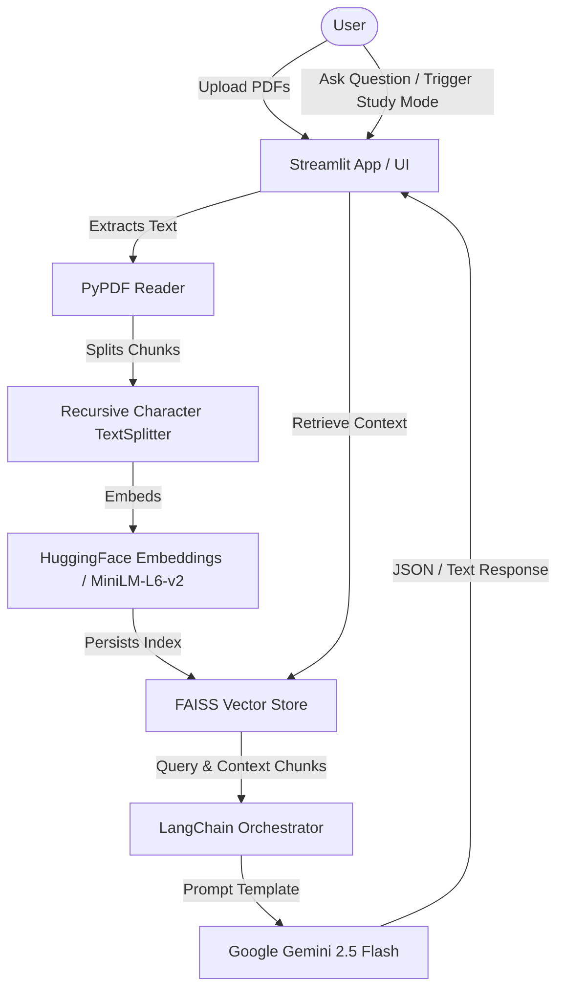

# 🎓 AI Study Assistant

An interactive, premium web application built with Streamlit and LangChain, designed to help students and professionals digest long lectures, notes, textbooks, and research materials faster. The application features a grounding retrieval-augmented generation (RAG) system, interactive study tools (flashcards, auto-graded quizzes), and audio capabilities (speech-to-text dictation and text-to-speech reading).

---

## 🌟 Key Features

### 1. State-of-the-Art PDF Upload Interface
- **Modern Dark Container Box**: A dark slate interface designed with HSL-tailored colors.
- **Sequential Multi-PDF Appends**: Statefully add PDFs one-by-one (via a dynamic `+` button) or all at once.
- **Dynamic Document Cards**: Custom list elements displaying the document icon (on a white rounded background), file name, size formatting (e.g. `25.7 KB` or `Indexed` for preloaded databases), and custom remove triggers (`ⓧ`).
- **Dynamic Processing States**: Centered action buttons with solid-green `PDF Ready!` success states indicating FAISS indexing completion.

### 2. RAG-Grounded Study Chatbot
- **Encapsulated Memory**: Cohere context through chat histories to allow long follow-up questions.
- **Fact Citation**: Inline footnotes matching document sources and page numbers, expanding into detailed source blocks.
- **Voice Dictate**: Client-side speech-to-text microphone button using the Web Speech Recognition API.
- **Read Aloud**: Synthesizer text-to-speech button to listen to answers.

### 3. Document Summarizer
- Automatically parses text across hundreds of pages and drafts a structured Study Guide.
- Includes executive overviews, key concept tables, chapter-wise detailed bullet points, and actionable tips.

### 4. Interactive Flashcards
- Generates front-to-back flipping flashcard concept decks dynamically from key-terms in the uploaded materials.
- Read Aloud capability is supported directly on the cards.

### 5. Practice Quizzes
- Generates multiple-choice questions (MCQs) testing core concepts.
- Features real-time grade checks, correct/incorrect feedback, detailed explanation popups, and score statistics with animation triggers.

---

## 🛠️ Architecture & Technology Stack



- **Frontend Framework**: [Streamlit](https://streamlit.io/) with custom premium light-theme CSS overrides and dynamic `:has` selectors.
- **PDF Extractor**: [PyPDF](https://github.com/py-pdf/pypdf) for page-by-page text extraction.
- **Text Chunking**: LangChain `RecursiveCharacterTextSplitter`.
- **Vector Database**: LangChain-integrated [FAISS](https://github.com/facebookresearch/faiss) local binary store (supporting sequential additions/deletions).
- **Embeddings Model**: sentence-transformers (`all-MiniLM-L6-v2`) via HuggingFace for fast local vectorizations.
- **Language Model**: [Google Gemini 2.5 Flash](https://deepmind.google/technologies/gemini/) (`gemini-2.5-flash`) via LangChain Google GenAI client.

---

## 🚀 Getting Started

### 📋 Prerequisites
- Python 3.9+
- A Google Gemini API Key

### 📦 Installation
1. Clone the repository and navigate to the project directory:
   ```bash
   cd AI-study-assistant
   ```
2. Install the required Python packages:
   ```bash
   pip install -r requirements.txt
   ```
   *(Ensure `streamlit`, `langchain-google-genai`, `langchain-community`, `pypdf`, `faiss-cpu`, and `langchain-huggingface` are installed).*

3. Create a `.env` file in the root directory and add your Gemini API Key:
   ```env
   GOOGLE_API_KEY=your_google_api_key_here
   ```

### 💻 Running the Application
Launch the Streamlit server using:
```bash
streamlit run app.py
```
Open `http://localhost:8501` in your browser to start using your AI Study Assistant!
